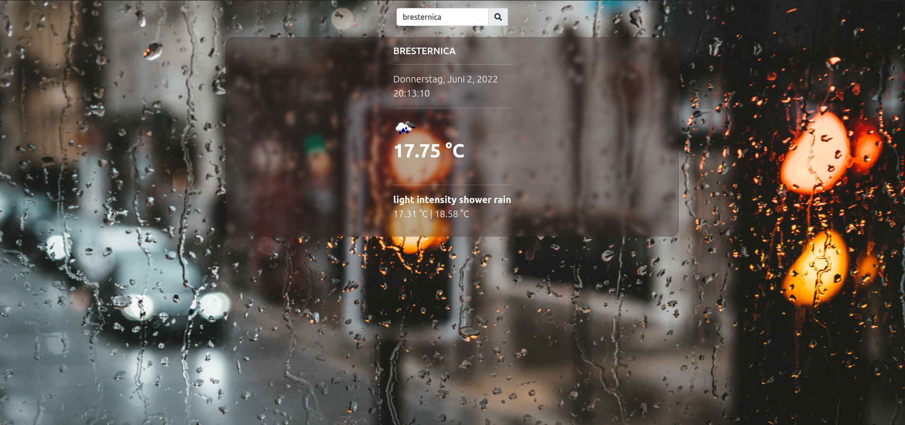
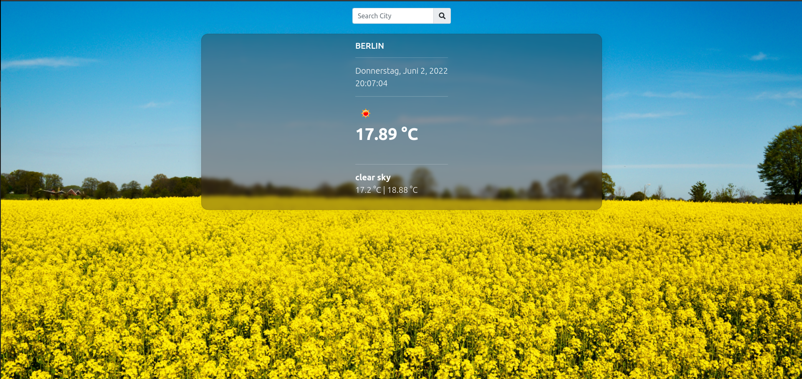
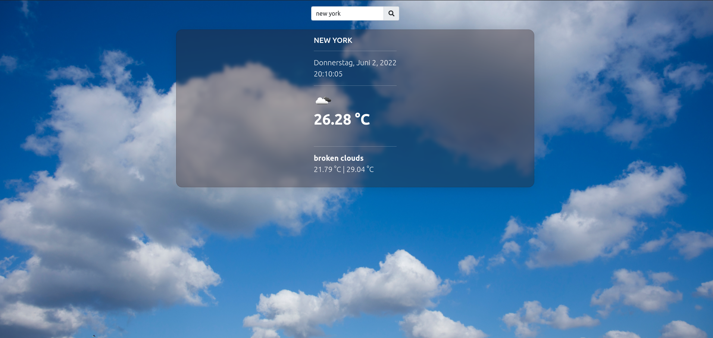

## Weather-App

- Wählen Sie Ihre gewünschte Stadt und erfahren Sie mehr Information über das Wetter von der Stadt. Viel Spaß!....
- Mit dem Wetter ändert sich der Hintergrund

* [Der Link von Projekt](https://weather-app-theta-one.vercel.app/)

## Tools

- Frontend : React, Hooks, Context-API, Bootstrap, CSS

- Tools : Github, VSCode, Github, Vercel, Rest API

## Reference Images :

  
  
  

